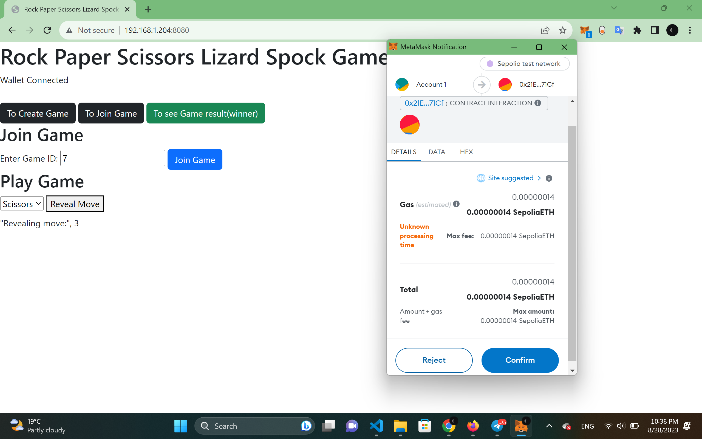

# RPS-Game5

Connect your wallet with (Test SepoliaETH).

1. Player 1 will create a game with a stake.
2. Player 1 will provide GameID to Player 2.
3. Player 2 will join the game using the provided GameID and the same stake.
4. Either Player 1 or Player 2 will choose their move.
5. The other player (Player 2 or Player 1, respectively) will choose their move.
6. Once both players have made their choices, you will be able to view the result using the corresponding GameID. (You can also view all results associated with any GameID you wish to see.)

     
Player1 connect wallet with 0.4808 SepoliaETH  
     

Player2 connect wallet with 0.5418 SepoliaETH  
    

Player1 create and stake with 0.1 SepoliaETH  
     

Player1 get GameID  
    

Player2 join game with gameId and same stake  
     

Player2 choose  3. Scissor  
    

Player1 choose 4. Lizard  
     

Player2 win with Scissor and earn 0.1 SepoliaETH   
    

We can review all GameWinner's history with gameID  
     

